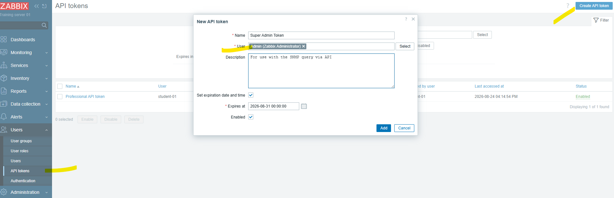
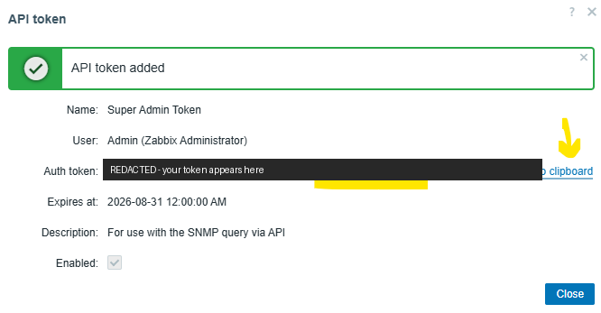
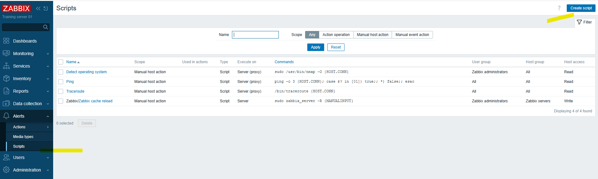
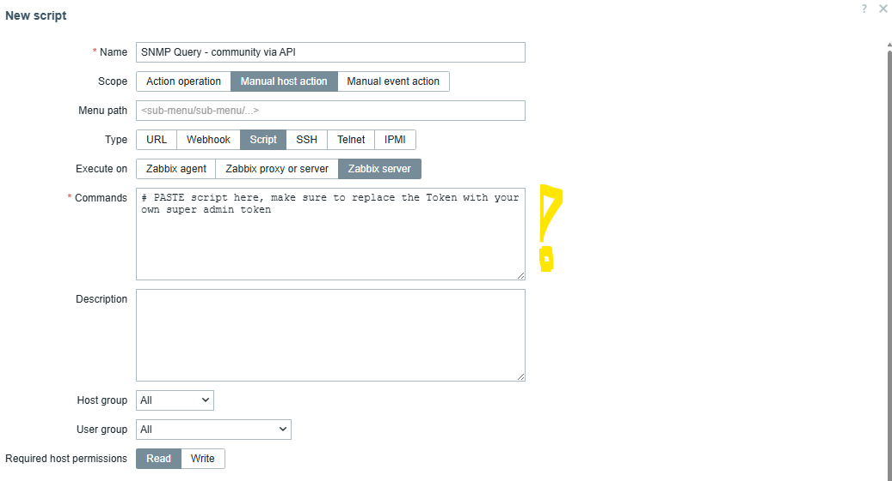
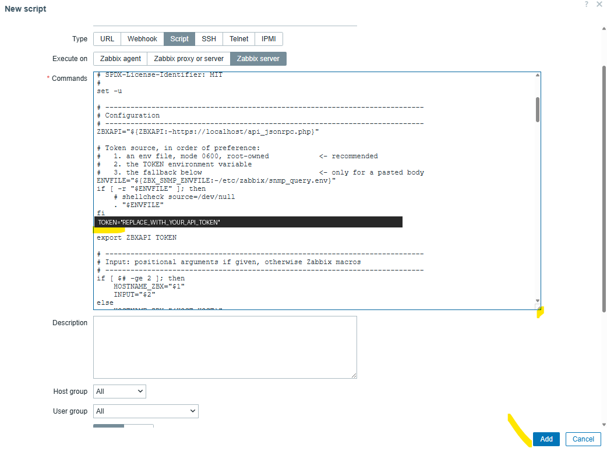
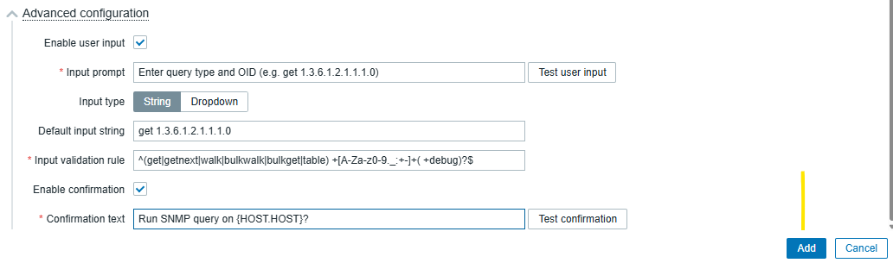
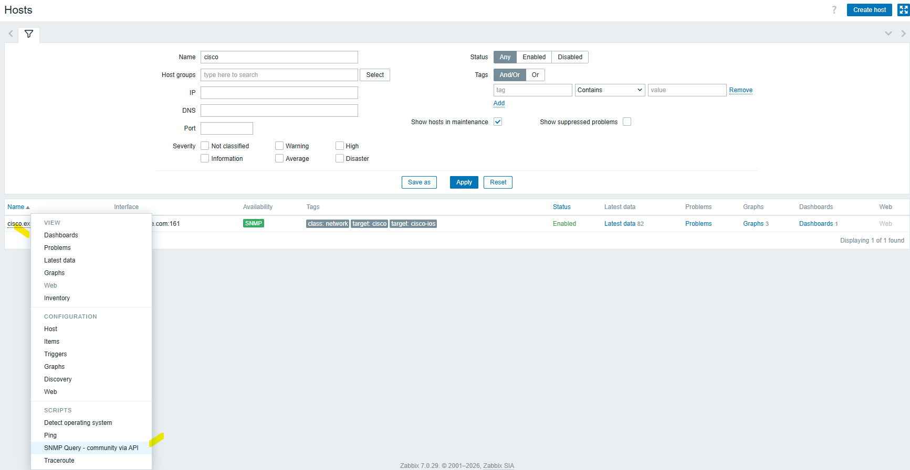
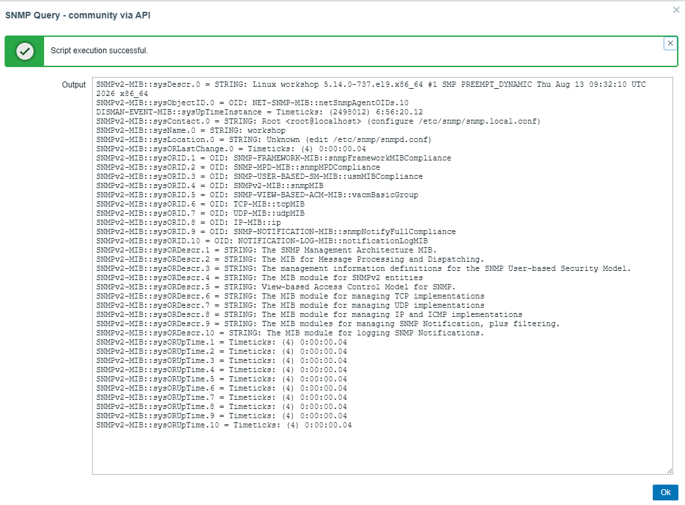

# zabbix-snmp-query

Ad-hoc SNMP queries from the Zabbix frontend, using the credentials Zabbix
already holds on the host's SNMP interface.

An operator picks a host, types an OID, and gets the raw SNMP response back in
a dialog. No SSH to the Zabbix server, no credentials handed around, no second
inventory of community strings to keep in sync with reality.

Verified on **Zabbix 7.0.x** against Cisco NX-OS (SNMPv3, authPriv) and Huawei
YunShan (SNMPv2c).

```
iso.3.6.1.2.1.1.1.0 = STRING: "Cisco NX-OS(tm) ... Version 10.3(5) ..."
```

## Why

The SNMP interface record in Zabbix is the authoritative credential for a
device — it is what the poller uses. A diagnostic tool that reads the same
record inherits that authority for free:

- **No credential drift.** Nothing to update when a community string or
  SNMPv3 passphrase rotates.
- **The result means something.** If the manual query authenticates, polling
  authenticates. If it fails, you have found a real problem rather than a
  stale copy in a script.
- **Least exposure.** Operators troubleshoot SNMP without ever being told the
  credentials.

## What it handles

- SNMPv1, v2c and v3
- All three v3 security levels (noAuthNoPriv, authNoPriv, authPriv)
- All six auth protocols (MD5, SHA1, SHA224/256/384/512) and all six privacy
  protocols (DES, AES128/192/256, AES192C, AES256C)
- `{$MACRO}` references in interface fields, resolved with correct precedence
  (global → template-inherited → host)
- Non-default SNMP ports and SNMPv3 context names
- Passphrases containing shell metacharacters

## Try it in five minutes

Nothing to install but the SNMP tools. Everything else is done in the frontend.

**0. On the Zabbix server, once:**

```bash
sudo apt install snmp

# Zabbix 7.0+ ships new installs with global scripts DISABLED
grep EnableGlobalScripts /etc/zabbix/zabbix_server.conf
```

If that shows `EnableGlobalScripts=0`, set it to `1` and restart
(`sudo systemctl restart zabbix-server`). Without it, every manual script —
including the built-in Ping and Traceroute — fails with
*"Global script execution on Zabbix server is disabled by server
configuration."*

**1. Get a token.** *Users → API tokens → Create API token*. Assign it to a
**Super admin** user.



Copy the value when it appears — Zabbix shows it only once.



**2. Create the script.** *Alerts → Scripts → Create script*.



Fill in:

| Field | Value |
|---|---|
| Name | `SNMP Query` |
| Scope | `Manual host action` |
| Type | `Script` |
| Execute on | `Zabbix server` |
| Commands | paste all of [`zbx_snmp_query.sh`](zbx_snmp_query.sh) |



**3. Paste your token** into the pasted script body, replacing
`REPLACE_WITH_YOUR_API_TOKEN` on this line:

```sh
TOKEN="${TOKEN:-REPLACE_WITH_YOUR_API_TOKEN}"
```



**4. Turn on user input.** Same dialog, **Advanced configuration** →
*Enable user input*:

| Field | Value |
|---|---|
| Input prompt | `Enter query type and OID (e.g. get 1.3.6.1.2.1.1.1.0)` |
| Default input string | `get 1.3.6.1.2.1.1.1.0` |
| Input validation rule | `^(get\|getnext\|walk\|bulkwalk\|bulkget\|table) +[A-Za-z0-9._:+-]+( +debug)?$` |

Optionally tick *Enable confirmation* with confirmation text
`Run SNMP query on {HOST.HOST}?` so operators see which host they're about to
query.



Click **Add**.

**5. Use it.** *Monitoring → Hosts* → click any SNMP host → **SNMP Query**.



Press Enter on the default OID:



> ⚠️ This stores the token in the Zabbix database, where anyone with
> **Reports → Scripts** access can read it. Good for trying the tool out;
> use the hardened install below for production.

## Hardened install

Keeps the token out of the database, in a root-owned env file:

```bash
sudo install -o root -g zabbix -m 0750 \
     zbx_snmp_query.sh /usr/lib/zabbix/externalscripts/zbx_snmp_query.sh

printf 'TOKEN=your-api-token\n' | sudo tee /etc/zabbix/snmp_query.env >/dev/null
sudo chown root:zabbix /etc/zabbix/snmp_query.env
sudo chmod 640 /etc/zabbix/snmp_query.env
```

Then the same script definition as above, but **Commands** becomes one line:

```sh
/usr/lib/zabbix/externalscripts/zbx_snmp_query.sh '{HOST.HOST}' '{MANUALINPUT}'
```

The same file works both ways — it uses positional arguments when given, and
falls back to the `{HOST.HOST}` / `{MANUALINPUT}` macros when pasted in.

Full setup, permissions and troubleshooting: **[docs/HOWTO.md](docs/HOWTO.md)**.

> **The validation rule is a security control, not a convenience.** Zabbix
> substitutes `{MANUALINPUT}` into the command text *before* any shell parses
> it. Without a restrictive pattern, operator input is a shell injection vector
> on your Zabbix server. See [SECURITY.md](SECURITY.md).

## Usage

| Input | Result |
|---|---|
| `get 1.3.6.1.2.1.1.1.0` | sysDescr — the standard reachability check |
| `get 1.3.6.1.2.1.1.5.0` | sysName — confirms you reached the device you meant |
| `walk 1.3.6.1.2.1.2.2.1.2` | ifDescr — interface list |
| `bulkwalk 1.3.6.1.2.1.31.1.1.1.1` | ifName, faster on large tables |
| `get 1.3.6.1.2.1.1.1.0 debug` | prints resolved parameters, then queries |

Debug mode prints what the script resolved, passphrases withheld — the fastest
way to answer "is Zabbix using the credentials I think it is":

```
DEBUG: v3 target=192.0.2.10:161 level=authPriv user=snmpuser auth=MD5 priv=AES context=-
```

## The two traps this exists to document

**Zabbix's SNMP interface enums are zero-based.** `authprotocol: 0` is MD5, not
SHA1. Getting this wrong yields `Authentication failure (incorrect password,
community or key)` — identical to the error for a wrong passphrase, because key
derivation differs and the device rejects the message before privacy is
evaluated. SNMPv2c hides the bug entirely, since a community string needs no
mapping. Full table in [docs/HOWTO.md §3.1](docs/HOWTO.md).

**Zabbix runs script bodies under `/bin/sh`, not bash.** The shebang is ignored.
On Debian/Ubuntu that is dash, so `<<<`, `[[ ]]` and arrays fail at parse time
with `sh: NN: Syntax error: redirection unexpected`. This script is POSIX-only;
verify any changes with `dash -n zbx_snmp_query.sh`.

## Repo contents

```
zbx_snmp_query.sh          the script (external or pasted-body invocation)
tools/inspect_interface.sh diagnostic: dump a host's SNMP interface config
docs/HOWTO.md              setup, troubleshooting, enum reference
docs/images/               quickstart screenshots
SECURITY.md                token handling and injection surface
```

`tools/inspect_interface.sh` decodes the enums for you, which is usually the
fastest first step when a query fails:

```bash
ZBX_TOKEN=xxxx ./tools/inspect_interface.sh -s example
```

## Requirements

- Zabbix 7.0.x (should work on 6.4+; `Authorization: Bearer` and
  `selectInheritedMacros` are the version-sensitive parts)
- `snmp` and `python3` on the Zabbix server — stdlib only, no pip installs
- A **Super admin** API token: interface passphrases are returned only to users
  with write access to the host

## Known limitations

- **Secret text and Vault macros cannot be read.** The API never returns their
  values. The script detects this and says so explicitly rather than failing
  with a confusing SNMP error, but there is no workaround short of storing the
  credentials differently.
- **AES-192/256 need net-snmp built with `--enable-blumenthal-aes`.** Check with
  `net-snmp-config --configure-options | grep -o blumenthal`.
- **Symbolic OIDs** (`sysDescr.0`, `IF-MIB::ifDescr`) pass validation but only
  resolve if MIBs are installed on the Zabbix server.
- Queries run from the Zabbix **server**, not from a proxy, so proxy-monitored
  devices must also be reachable from the server.

## Contributing

Issues and PRs welcome, particularly reports from other Zabbix versions or from
vendors not listed above. Please run `dash -n` and `shellcheck` before opening a
PR — CI runs both.

## Licence

MIT — see [LICENSE](LICENSE).
